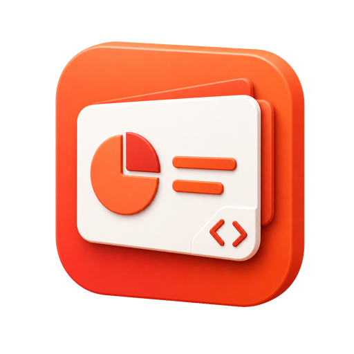

<p align="center">
  
</p>

<h1 align="center">pptx-native</h1>

<p align="center">
  HTML/CSS 到原生 PowerPoint 的编译器与 Agent Skill
</p>

`pptx-native` 将 HTML/CSS 编译为 `.pptx`。文本、形状、图片、媒体、图表、
动画和转场以 PowerPoint 原生对象写入，可在 PowerPoint 中继续编辑。

Skill 覆盖内容规划、视觉设计、动画编排和质量检查。编译器执行浏览器布局解析、
OOXML 生成与文件验证。

## 主要能力

### 完整演示文稿生成

Agent 可以根据主题、材料、大纲或已有数据完成：

- 受众与演示目标分析；
- 叙事结构和页面顺序；
- 页面文案与演讲者备注；
- 视觉方向与跨页节奏；
- 图片、图表和媒体配置；
- 动画、转场与 Morph 编排；
- 编译、渲染和质量检查。

示例任务：

```text
制作一份 12 页新品发布演示。深色视觉系统，以产品特写和核心参数为主，
章节切换使用 Morph，所有图表保留可编辑数据。
```

```text
将调研材料整理为董事会简报。采用结论先行结构，减少正文，
突出三项关键证据和最终决策。
```

### HTML/CSS 设计界面

支持常用浏览器布局和视觉属性：

- flex、grid、百分比、绝对定位、正常文档流；
- 字体、字号、字重、字距、行距、对齐和富文本；
- 纯色、透明度、线性渐变、径向渐变；
- 圆角、边框、阴影、辉光、模糊、倒影；
- rotate、flip、原生 3D tilt；
- `object-fit: cover` 图片裁切；
- SVG 路径、折线、连接线和箭头。

浏览器负责计算元素几何。编译结果使用计算后的尺寸、位置、样式和层级。

### 原生 PowerPoint 对象

| HTML/Scene 内容 | PowerPoint 输出 |
|---|---|
| 标题、正文、标签 | 文本框与富文本 |
| 布局区块 | 形状与对象组 |
| SVG 路径、线条、箭头 | 自由形状与连接线 |
| 图片 | 原生图片与裁切参数 |
| 视频、音频 | 原生媒体对象 |
| 表格 | 可编辑表格 |
| 数据图表 | 可编辑图表与工作簿数据 |
| 演讲者备注 | Notes |
| CSS 动画 | Animation Pane 时间轴 |
| 页面状态变化 | Morph 转场 |

内置 165 种 PowerPoint preset geometry。

### 动画与转场

支持以下动画能力：

- fade、wipe、zoom、fly、scale、rotate、recolor；
- opacity、motion、scale、rotation 和 color 的并行动画；
- 多步关键帧与运动路径；
- 组内 stagger、overlap 和 cascade；
- 点击触发、对象触发、自动播放；
- 循环、往返和 ambient 动画；
- fade、push、wipe、split、morph 转场；
- 图片裁切状态之间的 Ken Burns / Morph。

Skill 提供语义化动画编排：

- `compose`：单个焦点对象的组合动作；
- `sequence`：一组对象的错峰与重叠；
- `timeline`：主轴绘制后生成节点；
- `hubSpoke`：对象从中心锚点向外展开；
- `metricCluster`：指标组按视觉层级进入；
- `ambient`：背景漂移、呼吸、轨道和媒体播放。

卡片、标签和内部文字可以按同一动画单元处理。跨页持续对象使用稳定
`data-morph` 标识。

### 设计规划

从零生成演示文稿时，Skill 建立四项内部计划：

| 计划 | 内容 |
|---|---|
| Style Score | 视觉方向、配色角色、字体、图像语言、效果政策、明暗节奏 |
| Copy Plan | 每页可见文字与备注 |
| Visual Score | 页面任务、视觉锚点、信息关系、构图和跨页差异 |
| Motion Score | 动画语法、主动作、进入顺序、持续对象 |

Skill 提供 14 种构图轮廓：

`cover`、`statement`、`split`、`editorial`、`hero-media`、`metric`、
`comparison`、`timeline`、`process`、`evidence`、`gallery`、`matrix`、
`closing`、`custom`。

这些轮廓定义信息区域和起始几何。颜色、字体、图像、比例和装饰由 Agent
根据内容决定。`custom` 用于原创构图。

### 设计与内容检查

设计检查覆盖以下问题：

- 标题位置和标题组合在多页中机械重复；
- 英文小标题与中文大标题固定配对；
- 底部注释被用作装饰；
- 同尺寸矩形和卡片连续铺排；
- 正文块数量或长度过高；
- 图表缺少明确证据目标；
- 具象主题缺少有效视觉素材；
- 时间线节点缺少空间来源；
- 容器与内部内容分别动画；
- 持续对象未使用 Morph；
- 多个独立动画缺少统一编排。

Lint 结果分为：

| 类型 | 处理要求 |
|---|---|
| `quality` | 修复可读性、裁切、溢出和视觉质量问题 |
| `contract` | 修复原生对象、数据证据和动画连续性问题 |
| `advisory` | 复核审美选择；可记录设计理由后保留 |

实验性构图可以使用 `data-ppt-design-rationale` 记录设计意图：

```html
<section
  class="ppt-slide"
  data-ppt-layout="custom"
  data-ppt-design-rationale="重复网格对应档案目录的分类系统">
</section>
```

### 构建报告

构建结果包含：

- lint errors、warnings 及分类；
- normalization 修正记录；
- 原生对象、动画和转场统计；
- OOXML 包验证结果；
- 无法原生表达的 `losses`；
- 自动调整过的动画或属性 `guards`。

## 快速开始

环境要求：

- Node.js
- Python 3
- Playwright Chromium

```bash
# 安装依赖
skills/pptx-native/scripts/setup.sh

# 编译
skills/pptx-native/scripts/build.sh deck.html deck.pptx
```

最小示例：

```html
<!doctype html>
<html>
<head>
  <style>
    @keyframes rise {
      from { opacity: 0; transform: translateY(20px); }
      to   { opacity: 1; transform: translateY(0); }
    }

    .ppt-slide {
      width: 1280px;
      height: 720px;
      display: flex;
      flex-direction: column;
      justify-content: center;
      padding: 96px;
      background: #fff;
      color: #111;
    }

    h1 {
      width: 900px;
      font-size: 64px;
      animation: rise .5s ease-out both;
    }
  </style>
</head>
<body>
  <section class="ppt-slide">
    <h1>HTML/CSS 编译为原生 PowerPoint</h1>
    <p style="font-size:24px">页面对象可在 PowerPoint 中继续编辑。</p>
  </section>
</body>
</html>
```

## Agent Skill

Skill 入口：[skills/pptx-native/SKILL.md](skills/pptx-native/SKILL.md)

执行流程：

1. 分析受众、目标和材料；
2. 生成 Style、Copy、Visual、Motion 四项计划；
3. 编写 HTML/CSS；
4. 编译为 PPTX；
5. 检查 lint、loss report、结构验证和页面渲染；
6. 修正后输出文件。

## 实现概览

```text
HTML/CSS → Browser Layout → Scene JSON → OOXML → Validate → PPTX
```

- `html2scene` 读取浏览器计算后的几何、样式和动画；
- `pptx_native` 写入原生文本、形状、媒体、图表、时间轴与转场；
- lint、validate 和视觉 QA 检查编译结果。

详细说明：

- [docs](docs/)
- [Skill references](skills/pptx-native/references/)

## 当前边界

PowerPoint 缺少直接对应的 CSS 能力时，构建报告会记录 loss。常见项目：

- conic gradient；
- `clip-path`；
- `mix-blend-mode`；
- 动态 blur 半径；
- 动态阴影参数；
- 其他无法映射到 OOXML 的 CSS 属性。

可选处理方式包括对象分层、Morph、媒体和原生近似效果。
